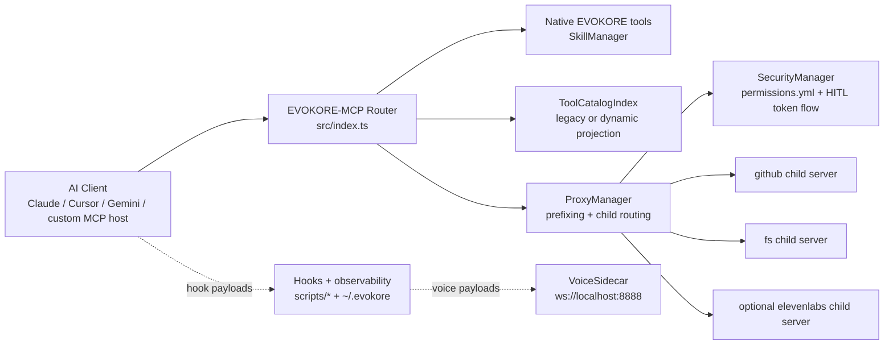

# EVOKORE-MCP

EVOKORE-MCP is a TypeScript-based stdio MCP router and multi-server aggregator. It gives AI clients a single MCP endpoint that combines EVOKORE’s native workflow tools with proxied child servers defined in `mcp.config.json`, while adding namespace isolation, dynamic tool discovery, and human-in-the-loop approval controls.

Current package/runtime version: `2.0.2`.

## Why EVOKORE exists

EVOKORE exists to solve three common MCP operator problems:

- **Too many disconnected MCP endpoints**: EVOKORE collapses multiple child servers into one stdio server.
- **Too much tool-context overhead**: EVOKORE can run in `legacy` mode for broad compatibility or `dynamic` mode for session-scoped tool activation.
- **Too little operational control**: EVOKORE adds HITL approval, duplicate-prefix collision handling, runtime guardrails, and continuity docs for long-running repo work.

## Current capabilities

- **Single stdio MCP endpoint** for native EVOKORE tools plus proxied child servers.
- **Native workflow tooling**: `docs_architect`, `skill_creator`, `resolve_workflow`, `search_skills`, `get_skill_help`, `discover_tools`.
- **Proxied server aggregation** from `mcp.config.json`, currently `github`, `fs`, and optional `elevenlabs`.
- **Prefixed proxied tools** in the form `${serverId}_${tool.name}` to avoid collisions.
- **Tool discovery modes**:
  - `legacy` (default): full native + proxied tool listing
  - `dynamic`: always-visible native tools plus session-activated proxied tools
- **Exact-name compatibility in dynamic mode**: hidden proxied tools still remain callable by exact prefixed name.
- **HITL approval flow** using `_evokore_approval_token`, with one-time, exact-args, short-lived retries.
- **Voice integrations** across proxied ElevenLabs tools, VoiceMode guidance, and the standalone VoiceSidecar.
- **Ops and governance hardening** for docs integrity, release flow, PR metadata, submodule cleanliness, tracker consistency, and Windows runtime behavior.

## System overview



## Quick start

### 1. Install and build

```bash
npm ci
npm run build
```

### 2. Configure environment

Copy `.env.example` to `.env` and set the values you need:

```bash
GITHUB_PERSONAL_ACCESS_TOKEN=your_token_here
ELEVENLABS_API_KEY=your_key_here

# Optional
EVOKORE_TOOL_DISCOVERY_MODE=legacy
# or
EVOKORE_TOOL_DISCOVERY_MODE=dynamic
```

### 3. Register EVOKORE with your MCP client

Point your client at the compiled runtime entrypoint:

```json
{
  "mcpServers": {
    "evokore-mcp": {
      "command": "node",
      "args": ["/absolute/path/to/EVOKORE-MCP/dist/index.js"]
    }
  }
}
```

You can also use the sync helper for supported CLIs:

```bash
npm run sync:dry
npm run sync
```

### 4. Start using the router

- In **legacy mode**, your client sees the full native + proxied tool list.
- In **dynamic mode**, use `discover_tools` to activate relevant proxied tools for the current session.
- For protected proxied tools, EVOKORE returns an `_evokore_approval_token` and requires explicit human approval before retry.

## Operator paths

- **First-time setup**: [docs/SETUP.md](docs/SETUP.md)
- **Day-to-day usage**: [docs/USAGE.md](docs/USAGE.md)
- **Practical walkthroughs**: [docs/USE_CASES_AND_WALKTHROUGHS.md](docs/USE_CASES_AND_WALKTHROUGHS.md)
- **Tool discovery behavior**: [docs/TOOLS_AND_DISCOVERY.md](docs/TOOLS_AND_DISCOVERY.md)
- **Voice and hooks**: [docs/VOICE_AND_HOOKS.md](docs/VOICE_AND_HOOKS.md)
- **Troubleshooting**: [docs/TROUBLESHOOTING.md](docs/TROUBLESHOOTING.md)

## Contributor and maintainer paths

- **Documentation portal**: [docs/README.md](docs/README.md)
- **Runtime architecture**: [docs/ARCHITECTURE.md](docs/ARCHITECTURE.md)
- **Validation surface**: [docs/TESTING_AND_VALIDATION.md](docs/TESTING_AND_VALIDATION.md)
- **Research and handoffs**: [docs/RESEARCH_AND_HANDOFFS.md](docs/RESEARCH_AND_HANDOFFS.md)
- **PR merge governance**: [docs/PR_MERGE_RUNBOOK.md](docs/PR_MERGE_RUNBOOK.md)
- **Submodule workflow**: [docs/SUBMODULE_WORKFLOW.md](docs/SUBMODULE_WORKFLOW.md)

## Runtime module summary

| Module | Role |
|---|---|
| `src/index.ts` | Main stdio MCP server, request handlers, discovery-mode projection, session activation state |
| `src/SkillManager.ts` | Native EVOKORE tools and skill indexing over `SKILLS/` |
| `src/ProxyManager.ts` | Child-server boot, prefixing, proxy execution, cooldown handling, env interpolation |
| `src/ToolCatalogIndex.ts` | Unified native + proxied tool catalog, search index, projected tool listing |
| `permissions.yml` | HITL/allow/deny policy for proxied tools |
| `mcp.config.json` | Child-server registry for `github`, `fs`, and optional `elevenlabs` |
| `src/VoiceSidecar.ts` | Standalone WebSocket voice runtime for hook-driven speech |
| `scripts/` | Config sync, hook observability, replay viewers, benchmark tooling, and governance helpers |

## Recent implementation and research highlights

- **Dynamic tool discovery MVP landed** with `legacy` default mode, opt-in `dynamic` mode, session-scoped activation, and exact-name compatibility for hidden proxied tools.
- **Discovery benchmarking now emits deterministic JSON by default**, with optional `--output` artifact writing and opt-in `--live-timings`.
- **HITL approval guidance and hardening were expanded** around `_evokore_approval_token`: one-time use, exact same arguments, and short-lived retry windows.
- **VoiceSidecar matured into a standalone runtime** on `ws://localhost:8888`, with `voices.json` hot-reload per new connection, playback disable support, and audio artifact saving.
- **Windows runtime behavior is now explicit**: EVOKORE remaps only `npx` to `npx.cmd`; `uv` and `uvx` must resolve directly on PATH.
- **Governance and continuity docs are first-class** through PR metadata validation, tracker consistency checks, next-session freshness validation, docs link validation, release gating, and research/session logs.

## Detailed documentation

- [docs/README.md](docs/README.md) — canonical docs portal
- [docs/SETUP.md](docs/SETUP.md) — install, env, client registration, and first-run validation
- [docs/ARCHITECTURE.md](docs/ARCHITECTURE.md) — runtime architecture, modules, routing, and tech stack
- [docs/TOOLS_AND_DISCOVERY.md](docs/TOOLS_AND_DISCOVERY.md) — native vs proxied tools, discovery lifecycle, and tradeoffs
- [docs/VOICE_AND_HOOKS.md](docs/VOICE_AND_HOOKS.md) — voice systems, hook pipeline, observability, and state locations
- [docs/TESTING_AND_VALIDATION.md](docs/TESTING_AND_VALIDATION.md) — subsystem validations, CI, release, Windows, and docs checks
- [docs/RESEARCH_AND_HANDOFFS.md](docs/RESEARCH_AND_HANDOFFS.md) — tracker, logs, continuity docs, and handoff conventions
- [docs/TRAINING_AND_USE_CASES.md](docs/TRAINING_AND_USE_CASES.md) — broader training material

## Validation references

- Full regression: `npm test`
- Build: `npm run build`
- Tool discovery contract: `node test-tool-discovery-validation.js`
- Discovery benchmark contract: `node test-tool-discovery-benchmark-validation.js`
- Voice sidecar and hook coverage: `node test-voice-sidecar-smoke-validation.js`, `node test-voice-sidecar-hotreload-validation.js`, `node hook-e2e-validation.js`
- Windows command/runtime coverage: `node test-windows-exec-validation.js`, `npx tsx test-windows-command-runtime-validation.ts`
- Governance/docs coverage: `node test-pr-metadata-validation.js`, `node test-docs-canonical-links.js`, `node test-version-contract-consistency.js`

## Contributing

This repository uses a PR-first workflow for meaningful changes.

1. Branch from `main`.
2. Keep docs and code aligned when you change runtime behavior.
3. For process/tooling/release-impacting changes, use `.github/pull_request_template.md` and follow [docs/PR_MERGE_RUNBOOK.md](docs/PR_MERGE_RUNBOOK.md).
4. Re-check [docs/README.md](docs/README.md) before landing cross-cutting changes.
