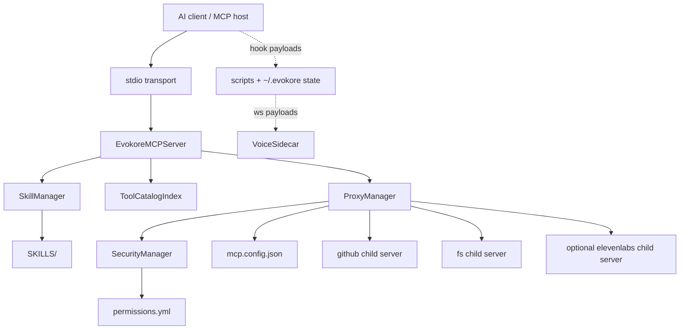
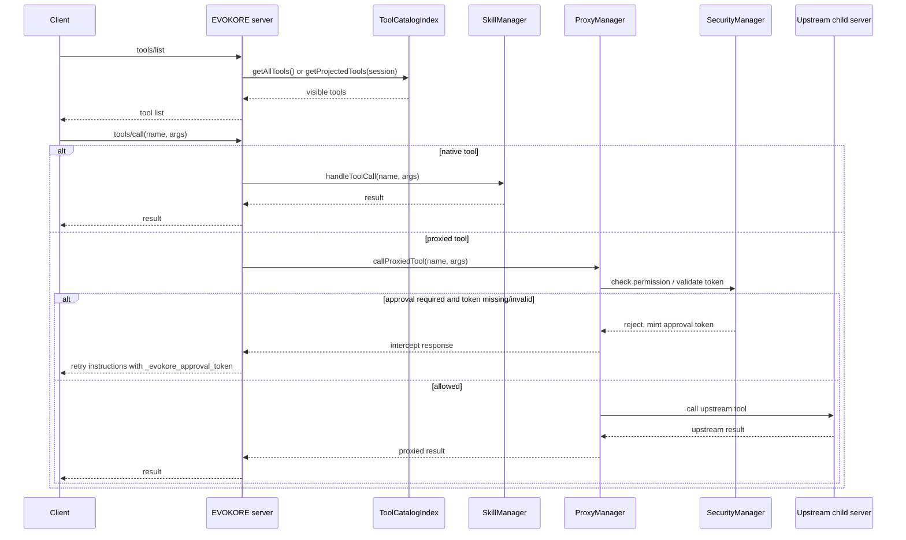

# EVOKORE Runtime Architecture

This document describes the current runtime shape of EVOKORE-MCP as shipped in `v2.0.2`.

## Runtime in one sentence

EVOKORE-MCP is a stdio MCP server that merges six native EVOKORE tools with a configurable set of proxied child MCP servers, then projects that combined tool surface in either `legacy` or `dynamic` discovery mode.

## Core runtime layers

| Layer | Current implementation | Responsibility |
|---|---|---|
| MCP server | `src/index.ts` | Owns stdio transport, MCP request handlers, discovery mode, and session-scoped tool activation |
| Native tool layer | `src/SkillManager.ts` | Provides EVOKORE-native tools and skill retrieval over `SKILLS/` |
| Proxy layer | `src/ProxyManager.ts` | Boots child servers from `mcp.config.json`, prefixes tools, forwards calls, and manages cooldown/error state |
| Security layer | `src/SecurityManager.ts` + `permissions.yml` | Applies `allow`, `require_approval`, and `deny` policy before proxied execution |
| Catalog/search layer | `src/ToolCatalogIndex.ts` | Merges native + proxied tools, indexes them, and builds projected tool lists |
| Voice side runtime | `src/VoiceSidecar.ts` | Separate standalone WebSocket voice server, not part of stdio routing |

## Tech stack

| Area | Technology |
|---|---|
| Language/runtime | TypeScript on Node.js `>=18` |
| MCP SDK | `@modelcontextprotocol/sdk` |
| Env loading | `dotenv` |
| Skill frontmatter parsing | `yaml` |
| Fuzzy search | `fuse.js` |
| Voice WebSocket runtime | `ws` |
| Validation/CLI helpers | Node scripts plus `tsx` for targeted TS runtime validation |

## Tool populations

### Native tools

These are always part of the EVOKORE runtime:

1. `docs_architect`
2. `skill_creator`
3. `resolve_workflow`
4. `search_skills`
5. `get_skill_help`
6. `discover_tools`

Native tools are always visible, even in `dynamic` mode.

### Proxied tools

Proxied tools are fetched from child MCP servers declared in `mcp.config.json`.

Current configured child servers:

- `github`
- `fs`
- `elevenlabs` (optional, requires `ELEVENLABS_API_KEY`)

Observed research/runtime snapshots have treated the proxied surface as roughly:

- `github_*`: about 26 tools
- `fs_*`: about 14 tools
- `elevenlabs_*`: about 24 tools when configured successfully

Exact counts still depend on the upstream child server versions present at runtime.

Tool names are rewritten from upstream `tool.name` to:

```text
${serverId}_${tool.name}
```

Examples:

- `fs_read_file`
- `github_create_issue`
- `elevenlabs_text_to_speech`

If two proxied registrations would create the same prefixed name, EVOKORE keeps the first registration and skips later duplicates. The runtime logs a duplicate-collision warning and summary.

## Discovery modes

| Mode | Behavior | Default |
|---|---|---|
| `legacy` | `tools/list` returns all native + proxied tools | Yes |
| `dynamic` | `tools/list` returns native tools plus only proxied tools activated for the current session | No |

In `dynamic` mode:

- `discover_tools` searches the combined catalog
- matching proxied tools are activated for that session
- EVOKORE sends `sendToolListChanged()` on a best-effort basis
- hidden proxied tools are still callable by exact prefixed name for compatibility

## Startup lifecycle

At startup, EVOKORE performs these steps in order:

1. Load `.env`
2. Initialize MCP server capabilities
3. Load permissions from `permissions.yml`
4. Index skills from `SKILLS/`
5. Load child server definitions from `mcp.config.json`
6. Resolve child env placeholders like `${ELEVENLABS_API_KEY}`
7. Boot each child server over stdio
8. Fetch child tool lists and register prefixed proxies
9. Rebuild the merged tool catalog
10. Connect the stdio transport and begin serving requests

## Module breakdown

### `src/index.ts`

Owns:

- server name/version (`2.0.2`)
- MCP capability registration
- `tools/list`, `tools/call`, resources, and prompt handling
- session activation state for dynamic discovery
- `discover_tools` activation flow

Notable current behavior:

- prompts are intentionally disabled in favor of tool-based retrieval
- default dynamic-session key falls back to `__stdio_default_session__`
- tool-list change notifications are best-effort, not required for correctness
- dynamic activation state is bounded in memory and stale session state is reset/pruned opportunistically

### `src/SkillManager.ts`

Owns:

- scanning and indexing `SKILLS/`
- YAML frontmatter parsing
- fuzzy search over skill metadata/content
- native tool definitions
- workflow/skill retrieval responses

It also actively uses proxied filesystem tools in `docs_architect` and `skill_creator` when those proxies are available.

### `src/ProxyManager.ts`

Owns:

- reading `mcp.config.json`
- booting child servers over stdio
- Windows-aware command resolution
- env placeholder interpolation with fail-fast error reporting
- proxied tool registry
- cooldown tracking keyed by normalized tool arguments
- proxied execution dispatch

Notable current behavior:

- on Windows, only `npx` is remapped to `npx.cmd`
- `uv` and `uvx` must already resolve on PATH
- unresolved `${VAR}` placeholders fail fast for that child server
- a proxied tool can be on cooldown after repeated/bad upstream failures

### `src/ToolCatalogIndex.ts`

Owns:

- merging native and proxied tool lists
- lightweight search keywords for discovery
- fuzzy matching for discovery queries
- projected tool lists for `dynamic` mode

It is the main bridge between:

- full router visibility
- slim client-visible projections
- discovery-based activation

### `src/VoiceSidecar.ts`

This is a separate runtime, not a proxied child server inside the router.

It:

- listens on `ws://localhost:8888` by default
- loads `voices.json`
- hot-reloads voice config on each new connection
- streams text to ElevenLabs
- optionally disables playback
- optionally saves `.mp3` artifacts

## System architecture diagram



## Request routing and information flow



## Runtime state and artifacts

| Path | Purpose |
|---|---|
| `.env` | Secrets and runtime mode toggles |
| `mcp.config.json` | Child server registry and per-server env |
| `permissions.yml` | Proxied tool policy |
| `voices.json` | VoiceSidecar default voice + personas |
| `~/.evokore/logs/hooks.jsonl` | Hook observability JSONL log |
| `~/.evokore/logs/hooks.jsonl.1` - `.3` | Rotated observability logs |
| `~/.evokore/sessions/*-replay.jsonl` | Session replay event logs |
| `~/.evokore/sessions/*-tasks.json` | TillDone task state |

## Historical design references

The current runtime docs in this file describe the shipped system. Historical or planning-oriented documents still exist and remain useful:

- [V2 architecture plan](./V2_ARCHITECTURE_PLAN.md)
- [V2 phase 2 architecture design](./V2_PHASE2_ARCHITECTURE_DESIGN.md)
- [V2 multi-agent workflows](./V2_MULTI_AGENT_WORKFLOWS.md)
