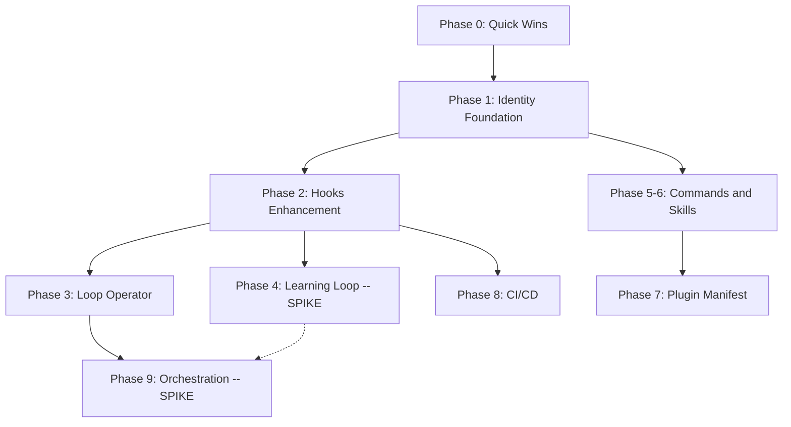
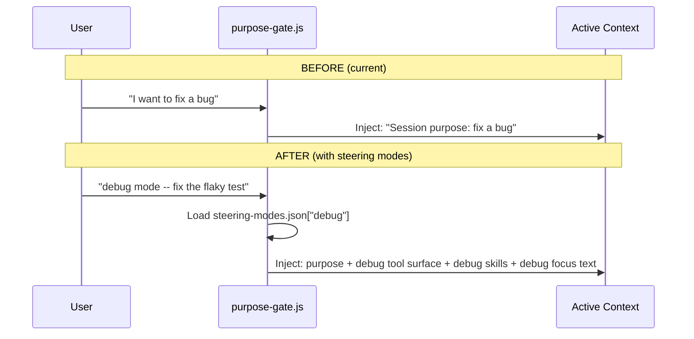

# ECC Integration Decision Memo

**Date:** 2026-03-30
**Source Repo:** [affaan-m/everything-claude-code](https://github.com/affaan-m/everything-claude-code) (119K stars)
**Target Repo:** EVOKORE-MCP v3.1.0
**Research:** 20 parallel agents covering all ECC subsystems, followed by 4-panel expert cascade review
**Status:** Awaiting direction approval (Gate 1)

> **Terminology:** Throughout this document, "session" means a focused ~4-hour work block with a single operator, matching EVOKORE's existing session manifest model.

---

## Section 1: Strategic Context

### Complementary Thesis

ECC is a **declarative configuration framework** -- static markdown/YAML files that shape Claude Code behavior through `.claude/` conventions, CLAUDE.md instructions, and command/skill libraries. EVOKORE-MCP is a **runtime MCP server** -- a TypeScript application with enforcement hooks, session isolation, multi-tenant security, and live tool proxying.

**These approaches are complementary, not competing.** EVOKORE should adopt ECC's declarative layer on top of its runtime enforcement layer, creating a system that is both self-aware (ECC's identity/behavioral model) and actively enforced (EVOKORE's hooks/RBAC/HITL).

### Capability Comparison (Grouped)

The original 17-row comparison matrix is condensed into four strategic categories.

#### 1. Identity and Behavioral -- ECC Stronger

| Capability | ECC | EVOKORE-MCP | Gap |
|---|---|---|---|
| Identity/Philosophy | SOUL.md, identity.json, values hierarchy | None | **CRITICAL** |
| Behavioral Rules | RULES.md (declarative) | damage-control-rules.yaml (enforcement only) | Complement |
| Steering Modes | dev/research/review/debug/security-audit presets | purpose-gate (single purpose per session) | **MODERATE** |
| Token/Context Mgmt | Token budget tracking, strategic compact | Purpose-gate focus injection | **MODERATE** |

#### 2. Runtime and Security -- EVOKORE Stronger

| Capability | ECC | EVOKORE-MCP | Gap |
|---|---|---|---|
| Security | RULES.md declarative policies | RBAC + HITL + SecurityManager + 7 hooks | EVOKORE stronger |
| MCP Server | None (file-based) | Full MCP v3.1 runtime, 19 native tools (as of 2026-04-10) | EVOKORE stronger |
| Webhooks/Events | None | WebhookManager: 10 event types, HMAC signing | EVOKORE stronger |
| Multi-Tenant | None | SessionIsolation + OAuth + FileSessionStore | EVOKORE stronger |
| Telemetry | None | TelemetryManager + HMAC export | EVOKORE stronger |
| Voice | None | VoiceSidecar + TTS/STT | EVOKORE stronger |

#### 3. Agent Fleet and Orchestration -- Both Strong, Cross-Pollinate

| Capability | ECC | EVOKORE-MCP | Gap |
|---|---|---|---|
| Agent Archetypes | 29 agents (language-specific, meta-agents) | 6 generic archetypes | ECC larger catalog |
| Orchestration | PM2 fleet, worktree-per-agent, loop operator | Agent33 framework, 8 DAG workflows | Cross-pollinate |
| Commands | 50+ slash commands | 19 native tools (as of 2026-04-10) + skill resolution (336+ skills) | Different models |
| Plugin System | Declarative plugin.json, marketplace | Imperative PluginManager + hot-reload | Complement |
| Session Management | Session save/resume, strategic compact | Session manifest + replay + evidence JSONL | Complement |

#### 4. Learning and Evolution -- ECC Stronger

| Capability | ECC | EVOKORE-MCP | Gap |
|---|---|---|---|
| Continuous Learning | CL v2: feedback, eval, instinct evolution | Session replay + evidence capture (passive) | **LARGE** |
| Self-Model | Homunculus: behavioral patterns across sessions | None | **LARGE** |
| CI/CD | Reusable workflows, commitlint, changelog | Basic PR template + validation scripts | **MODERATE** |
| Multi-IDE | 7 IDE adapters | Claude Code only | **LARGE** (but low priority) |

### Illustrative SOUL.md for EVOKORE

See Appendix A for a full excerpt. The key insight: SOUL.md provides a persistent identity document that is loaded into context alongside CLAUDE.md but serves a distinct purpose -- "who I am" rather than "how the project works."

---

## Section 2: Due Diligence Results

A 4-panel expert cascade (Feasibility, Security, Architecture, Prioritization) reviewed the original 9-phase plan. This section summarizes their findings.

### Findings Severity Table

| Severity | Count | Examples |
|---|---|---|
| **Critical** | 4 | Read tool bypass, wrong baseline numbers, no acceptance criteria, solo-dev capacity mismatch |
| **High** | 6 | Missing kill criteria on learning loop, PM2 Windows untested, marketplace infeasible for solo dev, Phase 3 scope overreach, no dependency diagram validation, instinct ROI unproven |
| **Additional** | 10+ | Cross-IDE low ROI, domain orchestrators premature, internationalization speculative, harness optimizer redundant with telemetry, some commands duplicate existing skills |

### Top 3 Consequential Findings

**1. Read tool bypasses damage-control (CRITICAL -- FIXED)**
The PreToolUse matcher in `.claude/settings.json` previously matched only `Bash|Write`. The Read tool could exfiltrate sensitive files (`.env`, credentials) without interception. Fixed: matcher now includes `Read` (current value: `Bash|Edit|Write|Read`).

**2. Wrong baseline numbers throughout (CRITICAL -- CORRECTED)**
The original plan stated "5 native tools" -- the actual count is **19 native tools (as of 2026-04-10)** (11 SkillManager + 2 telemetry + 1 reload_plugins + 2 NavigationAnchorManager + 3 SessionAnalyticsManager). The plan stated "5 hooks" -- the actual count is **7 hook handlers** across 4 hook types. The plan stated "6 webhook events" -- the actual count is **10 event types**. All figures are corrected in this revision.

**3. No acceptance criteria on any phase (HIGH -- CORRECTED)**
The original plan described deliverables but never stated how to verify them. Every phase in this revision includes explicit acceptance criteria.

### Feasibility Verdict Summary

| Phase | Panel Verdict | Notes |
|---|---|---|
| Phase 0: Quick Wins | FEASIBLE | Pure markdown, no code risk |
| Phase 1: Identity Foundation | FEASIBLE | SOUL.md + RULES.md + steering modes |
| Phase 2: Hooks Enhancement | FEASIBLE | after-edit, subagent, pre-compact |
| Phase 3: Agents (original full scope) | WITH MODS | Reduce to Loop Operator only |
| Phase 4: Learning Loop | NEEDS SPIKE | Unproven ROI, requires validation |
| Phase 5: Commands | FEASIBLE | Skill-based, incremental |
| Phase 6: Skills Import | FEASIBLE | Background task |
| Phase 7.1: Plugin Manifest | FEASIBLE | JSON schema migration |
| Phase 7.2-7.3: Remote plugins + Marketplace | INFEASIBLE | Solo dev cannot maintain marketplace |
| Phase 8.1: Cross-IDE | WITH MODS | CUT -- low ROI for single operator |
| Phase 8.2-8.4: CI/CD | FEASIBLE | Reusable workflows + commitlint |
| Phase 9: Orchestration Runtime | NEEDS SPIKE | PM2 Windows compat unvalidated |

---

## Section 3: Corrected Execution Plan

### Dependency Diagram



**Critical path:** Phase 0 --> Phase 1 --> Phase 2 --> Phase 4 (learning loop depends on hardened hooks).
**Independent tracks:** Phase 5-6 can run after Phase 1. Phase 8 can run after Phase 2.

### Phase 0: Quick Wins (Session 1)

Elevated from the original appendix. These items require no code changes or only trivial edits.

| Item | Deliverable | Acceptance Criteria |
|---|---|---|
| SOUL.md | `SOUL.md` at repo root | File exists, referenced in CLAUDE.md preamble, values hierarchy has >= 5 ranked values |
| RULES.md | `RULES.md` at repo root | File exists, covers all 5 policy domains (file access, tool, commit, session, escalation) |
| Read tool fix | Updated matcher in `.claude/settings.json` | **DONE** -- matcher is `Bash\|Edit\|Write\|Read` |
| Steering modes JSON | `scripts/steering-modes.json` | File parses as valid JSON, contains >= 5 modes (dev, research, review, debug, security-audit), each with `focus`, `tools`, `skills` keys |
| Top 10 ECC skills | 10 skill files in `SKILLS/` | Each has valid frontmatter, passes `SkillManager.loadSkills()` without error |

### Phase 1: Identity Foundation (Sessions 2-3)

Build the declarative identity layer that ECC has and EVOKORE lacks.

**1.1 SOUL.md -- System Identity Document**

```
SOUL.md (repo root)
  Identity block -- who EVOKORE-MCP is (aggregator, enforcer, orchestrator)
  Values hierarchy -- correctness > speed, safety > convenience, evidence > assumption
  Core instincts -- verify before trust, enforce don't suggest, isolate by default
  Communication style -- terse, evidence-backed, action-oriented
  Anti-patterns -- never skip hooks, never trust unverified input, never guess state
```

Integration points:
- Referenced in CLAUDE.md preamble (`See SOUL.md for behavioral identity`)
- Values hierarchy feeds into purpose-gate prompt injection
- Instincts become the seed for Phase 4's instinct evolution system

Acceptance criteria:
- [ ] SOUL.md exists at repo root with all 5 sections
- [ ] CLAUDE.md contains a reference to SOUL.md in first 10 lines
- [ ] purpose-gate.js reads and injects at least the values hierarchy on session start

**1.2 RULES.md -- Declarative Security Policies**

Complements the existing `damage-control-rules.yaml` with higher-level declarative intent.

```
RULES.md (repo root)
  File access policies -- which paths require what permissions
  Tool restrictions -- tiered tool access (allow/approval/deny)
  Commit policies -- conventional commits, PR template enforcement
  Session policies -- purpose requirement, evidence capture mandates
  Escalation policies -- when to require human approval
```

Integration: `damage-control.js` reads RULES.md as supplementary policy source. Runtime enforcement stays in YAML; RULES.md adds the "why" and covers non-hook scenarios.

Acceptance criteria:
- [ ] RULES.md exists at repo root with all 5 policy sections
- [ ] damage-control.js loads RULES.md without error (graceful fallback if missing)
- [ ] At least one policy from RULES.md is enforced at runtime (e.g., file access)

**1.3 Steering Modes**

Named context presets that reconfigure the active instruction surface.

- `scripts/steering-modes.json` -- mode definitions (dev, research, review, debug, security-audit)
- Each mode specifies: active CLAUDE.md sections, tool surface, focus injection text, relevant skills
- `purpose-gate.js` enhanced to accept mode selection on session start
- `/mode` command for runtime switching

See Appendix B for a before/after flow diagram.

Acceptance criteria:
- [ ] steering-modes.json contains >= 5 mode definitions
- [ ] purpose-gate.js accepts mode names and loads the corresponding configuration
- [ ] Mode switch changes the injected context in the next prompt cycle

### Phase 2: Hooks Enhancement (Sessions 4-5)

**2.1 After-File-Edit Hook**

ECC fires a hook after any file edit. Useful for auto-formatting, dependency graph invalidation, and test-relevant-file detection.

Create: `scripts/hooks/after-edit.js` -- PostToolUse hook filtering for Edit/Write tool results.

Acceptance criteria:
- [ ] Hook fires on Edit and Write tool completions
- [ ] Hook logs affected file paths to session evidence
- [ ] Hook does not add more than 50ms to tool completion time

**2.2 Subagent Lifecycle Tracking**

Create: `scripts/hooks/subagent-tracker.js` -- PostToolUse hook capturing Agent tool invocations. Tracks active agents, their purposes, and worktree assignments. Feeds into session manifest for continuity.

Acceptance criteria:
- [ ] Hook captures Agent tool start events with agent purpose
- [ ] Active agent count is visible in session manifest
- [ ] `npm run status` reflects active subagent count

**2.3 Pre-Compact State Preservation**

Hook or CLAUDE.md instruction to dump critical state (active tasks, current purpose, key findings) to session manifest before compaction triggers.

Acceptance criteria:
- [ ] State dump fires before context compaction
- [ ] Dump includes: active tasks, session purpose, key file paths, open questions
- [ ] State is recoverable from session manifest after compaction

### Phase 3: Loop Operator Only (Session 6)

**REDUCED SCOPE:** The original Phase 3 included language-specific reviewers (8), build resolvers (6), a harness optimizer, and domain-scoped orchestrators. The panel found this overreaches for a solo dev. Only the Loop Operator meta-agent is retained -- it is the single highest-value addition with no EVOKORE equivalent.

**AGT-LOOP (Loop Operator):**
- Monitors other agents for degenerate iteration (same error > 3 times, no progress in > 10 minutes)
- Can intervene: change approach, escalate to human, terminate agent
- Create: `SKILLS/ORCHESTRATION FRAMEWORK/agent-archetypes/AGT-013-loop-operator.json`

**DEFERRED (nice-to-have, not core):**
- Language-specific reviewers (AGT-007 through AGT-012) -- EVOKORE's existing reviewer archetype handles TypeScript, which is the primary language
- Language-specific build resolvers -- npm/vitest is the only build system in use
- Harness optimizer -- redundant with TelemetryManager
- Domain-scoped orchestrators -- premature without runtime fleet management

Acceptance criteria:
- [ ] AGT-LOOP archetype file exists with valid JSON schema
- [ ] Loop detection logic triggers after 3 identical errors from the same agent
- [ ] Intervention options are documented: change-approach, escalate, terminate
- [ ] Integration test: simulated degenerate loop is detected within 5 iterations

### Phase 4: Automated Learning -- SPIKE-DEPENDENT (Sessions 7-8)

**Requires spike to validate:** Can session evidence JSONL actually feed useful patterns back into behavior? This is ECC's most ambitious claim and EVOKORE's largest gap, but ROI is unproven.

**Kill criteria:** If pattern extraction precision < 70% after 10 sessions of evidence, abandon this phase entirely and keep session replay as a passive diagnostic tool.

**4.1 Spike Deliverable (first half of Session 7)**

- `scripts/eval-harness.js` -- Post-session evaluator analyzing evidence JSONL
- `scripts/pattern-extractor.js` -- Identifies recurring success/failure patterns
- Run against 10 existing session evidence logs
- Measure: how many extracted patterns are actionable vs noise?
- Decision gate: proceed only if precision >= 70%

**4.2 Instinct File Format (if spike passes)**

```yaml
instincts:
  - id: INS-001
    rule: "Always run tests before committing"
    confidence: 0.92
    evidence_count: 47
    last_updated: 2026-03-30
    source: "pattern-extractor"
    version: 3
  - id: INS-002
    rule: "Read file before editing -- prevents blind edits"
    confidence: 0.98
    evidence_count: 156
    last_updated: 2026-03-30
    source: "evidence-capture"
    version: 7
```

- `~/.evokore/instincts.yaml` -- Evolved behavioral rules with confidence scores
- `scripts/instinct-evolver.js` -- Updates instinct confidence based on evidence
- purpose-gate.js enhanced to inject top-N instincts (by confidence) into context

**4.3 Homunculus -- Agent Self-Model (if spike passes)**

- `~/.evokore/homunculus.json` -- Accumulated self-model
- Tracks: common tool sequences, error recovery patterns, time-to-completion trends
- Fed into purpose-gate for self-aware context injection

Acceptance criteria:
- [ ] Spike produces a written verdict document with precision measurement
- [ ] If proceeding: instincts.yaml is populated from real evidence, not synthetic data
- [ ] If proceeding: purpose-gate injects top 5 instincts by confidence score
- [ ] If proceeding: homunculus.json updates after each session close

### Phase 5-6: Commands and Skills (Sessions 9-12)

Condensed from the original two separate phases.

**Priority Commands to Port (Top 10):**

| Priority | Command | Description | Implementation |
|---|---|---|---|
| 1 | `/tdd` | Test-driven development cycle | Skill + workflow template |
| 2 | `/verify` | Run full verification suite | Skill wrapping vitest + lint |
| 3 | `/quality-gate` | Pre-merge quality check | Skill + CI integration |
| 4 | `/context-budget` | Show token budget status | Skill + telemetry integration |
| 5 | `/compact` | Manual context compaction | Skill wrapping built-in |
| 6 | `/session-save` | Snapshot current session state | Skill + session manifest |
| 7 | `/session-resume` | Restore from snapshot | Skill + session manifest |
| 8 | `/handoff` | Generate handoff document | Enhance existing skill |
| 9 | `/loop-start` | Begin iterative development loop | Skill + loop operator (Phase 3) |
| 10 | `/fleet-status` | Check all active agents | Skill + subagent tracker (Phase 2) |

Each command maps to a skill markdown file with proper frontmatter, registered through existing `SkillManager` + `resolve_workflow` semantic resolution.

**Skills Import (Background Task):**
- Import highest-value ECC skills that have no EVOKORE equivalent
- Focus on novel skills: fal-ai-media, content-engine, exa-search, claude-api patterns
- Skip language-specific skills that duplicate existing coverage
- Internationalization deferred -- speculative value for a single-operator system

Acceptance criteria:
- [ ] 10 command skills created with valid frontmatter
- [ ] Each command resolves via `resolve_workflow` semantic search
- [ ] `SkillManager.loadSkills()` completes without error after import
- [ ] At least 5 imported ECC skills adapted with EVOKORE frontmatter conventions

### Phase 7: Plugin Evolution (Sessions 13-14)

**7.1 Declarative Plugin Manifest (IN SCOPE)**

ECC uses `plugin.json` with permissions, dependencies, and cross-client support. EVOKORE uses imperative `register()`.

Create declarative manifest format:
```json
{
  "name": "example-plugin",
  "version": "1.0.0",
  "description": "Example plugin",
  "permissions": ["fs:read", "network:fetch"],
  "dependencies": ["@anthropic-ai/sdk"],
  "tools": [
    {
      "name": "example_tool",
      "handler": "./tools/example.js",
      "annotations": { "readOnlyHint": true }
    }
  ],
  "hooks": {
    "PostToolUse": "./hooks/post-tool.js"
  }
}
```

Migrate `PluginManager.ts` to discover and load `plugin.json` manifests alongside existing imperative plugins.

Acceptance criteria:
- [ ] PluginManager loads plugins with plugin.json manifests
- [ ] Existing imperative plugins continue to work (backwards compatible)
- [ ] Plugin permissions are validated before tool registration
- [ ] `reload_plugins` tool works with manifest-based plugins

**7.2 Remote Plugin Install -- CUT**
**7.3 Marketplace Index -- CUT**

Rationale: A solo developer cannot maintain a plugin registry, review submissions, handle security advisories, or provide SLA guarantees. Remote install and marketplace features require community infrastructure that does not exist. These are marked as post-v1, community-dependent.

### Phase 8: CI/CD (Sessions 15-16)

**8.1 Cross-IDE Configuration Adapters -- CUT**

Rationale: EVOKORE is a single-operator system targeting Claude Code. Building adapters for 6 additional IDEs (Cursor, Kiro, VS Code Copilot, OpenCode, Codex, Windsurf) has low ROI when there is no user base requesting it. Revisit if operator count grows.

**8.2 Reusable GitHub Actions Workflows (IN SCOPE)**

Create `.github/workflows/`:
- `reusable-test.yml` -- parameterized test runner
- `reusable-lint.yml` -- lint + format check
- `reusable-security.yml` -- security scanning
- `reusable-release.yml` -- release + changelog generation

**8.3 Conventional Commits + Commitlint (IN SCOPE)**

- Add `commitlint.config.js` with conventional commits rules
- Add commit-msg hook (complements existing damage-control)
- Enable automated changelog generation from commit history

**8.4 Automated Release Notes (IN SCOPE)**

- Categorize commits (feat/fix/chore/docs) into structured release notes
- Link to PRs and issues automatically
- Template in `docs/templates/release-notes.md`

Acceptance criteria:
- [ ] 4 reusable workflow files exist and pass `act` dry-run
- [ ] commitlint rejects non-conventional commit messages
- [ ] changelog generation produces accurate output for last 10 commits
- [ ] Release notes template renders with real commit data

### Phase 9: Orchestration Runtime -- SPIKE-DEPENDENT (Sessions 17-20)

**Requires spike:** PM2 Windows compatibility is unvalidated. EVOKORE runs on Windows 11 (see env context). PM2 is primarily tested on Linux/macOS.

**Spike deliverable (first half of Session 17):**
- Install PM2 on Windows, attempt to manage 3 concurrent Claude Code processes
- Validate: process start, stop, restart, log aggregation, crash recovery
- If PM2 fails on Windows: fall back to `child_process` fleet with manual lifecycle management

**9.1 Agent Fleet Management**
- `scripts/fleet-manager.js` -- PM2-based (or child_process fallback) agent lifecycle
- `ecosystem.config.js` -- process definitions for common agent patterns
- Integration with subagent-tracker hook from Phase 2.2

**9.2 Worktree-per-Agent Isolation**
- Wire fleet-manager to automatically create/cleanup worktrees per agent
- Leverage existing `scripts/repo-state-audit.js` for cleanup
- 1:1 mapping between agent processes and git worktrees

**9.3 Continuous Fleet Monitoring**
- Real-time agent health checks
- Token budget tracking per agent
- Automatic intervention via Loop Operator (Phase 3)
- Fleet dashboard extension to existing session dashboard

Acceptance criteria:
- [ ] Spike produces a written verdict on PM2 Windows compatibility
- [ ] Fleet manager can start, stop, and monitor 3+ concurrent agents
- [ ] Each agent gets its own git worktree, cleaned up on termination
- [ ] Loop Operator integration: degenerate agent triggers intervention
- [ ] Dashboard shows live fleet status

### Revised Scope Table

| Phase | Description | Sessions | New Files | Modified Files | Status |
|---|---|---|---|---|---|
| 0 | Quick Wins | 1 | 3-4 | 2-3 | Ready |
| 1 | Identity Foundation | 2 | 3-4 | 3-4 | Ready |
| 2 | Hooks Enhancement | 2 | 3 | 2-3 | Ready |
| 3 | Loop Operator | 1 | 1-2 | 1-2 | Ready |
| 4 | Learning Loop | 2 | 4-6 | 2-3 | SPIKE-DEPENDENT |
| 5-6 | Commands and Skills | 4 | 15-20 | 2-3 | Ready |
| 7 | Plugin Manifest | 2 | 2-3 | 1-2 | Ready |
| 8 | CI/CD | 2 | 6-8 | 2-3 | Ready |
| 9 | Orchestration Runtime | 4 | 5-8 | 3-4 | SPIKE-DEPENDENT |
| **Total** | | **20** | **~42-55** | **~18-27** | |

Compared to the original estimate of 28-43 sessions and 75-110 new files, this revision is **~50% smaller** due to scope cuts (cross-IDE, marketplace, language-specific agents, remote plugins).

---

## Section 4: Risk Register

| ID | Risk | Severity | Mitigation | Owner |
|---|---|---|---|---|
| R1 | Solo-dev capacity: 20 sessions at ~4hr each = 80 hours of focused work over weeks/months | High | Phase gates prevent wasted work; each phase is independently valuable; abandon any phase that misses acceptance criteria | Operator |
| R2 | Scope creep: each phase could expand beyond estimates as edge cases surface | High | Strict acceptance criteria per phase; time-box each session; defer "nice-to-have" items ruthlessly | Operator |
| R3 | PM2 Windows compatibility: untested on the target platform | Medium | Spike in Phase 9 with explicit fallback to child_process fleet management | Operator |
| R4 | Learning loop ROI: pattern extraction from session evidence may produce mostly noise | High | Kill criteria: < 70% precision after 10 sessions = abandon Phase 4; session replay remains as passive diagnostic | Operator |
| R5 | CLAUDE.md bloat: adding SOUL.md, RULES.md, steering modes, and instinct injection could push context usage past useful limits | Medium | Measure context token usage before and after Phase 1; set a budget ceiling (e.g., < 15% of context window for system instructions); steering modes should reduce active context, not increase it | Operator |
| R6 | Hook performance budget: adding after-edit, subagent-tracker, and pre-compact hooks increases per-tool latency | Medium | Each hook has a 50ms budget enforced by timeout; hooks that exceed budget are disabled; measure with TelemetryManager | Operator |
| R7 | Breaking changes from ECC imports: ECC conventions may conflict with established EVOKORE patterns (e.g., flat skill namespace vs hierarchical, per-file CLAUDE.md fragments vs single authoritative file) | Medium | "What NOT to Import" section is the exclusion list; every imported artifact must pass existing validation (SkillManager.loadSkills(), vitest suite) | Operator |

---

## What NOT to Import

This section was praised by the review panel and is preserved verbatim from the original plan.

- **ECC's file-based hook wiring** -- EVOKORE's `.claude/settings.json` + `scripts/hooks/` pattern is already more robust
- **ECC's flat skill namespace** -- EVOKORE's hierarchical `SKILLS/` with categories is better organized
- **ECC's lack of runtime enforcement** -- EVOKORE's SecurityManager + HITL + RBAC is strictly superior
- **ECC's per-file CLAUDE.md fragments** -- Keep single authoritative CLAUDE.md, use SOUL.md + RULES.md as supplements
- **ECC's static session management** -- EVOKORE's session manifest + replay + evidence is more comprehensive

---

## Section 5: Decision Request and Next Steps

### Two-Gate Approval Structure

**Gate 1: Direction Approval (requested now)**
- Approve the complementary thesis: adopt ECC's declarative layer on top of EVOKORE's runtime enforcement
- Authorize Phase 0 (Quick Wins) and Phase 1 (Identity Foundation)
- Estimated investment: 3 sessions (~12 hours)
- Reversible: SOUL.md, RULES.md, and steering modes are additive files that can be removed without code changes

**Gate 2: Continuation Approval (after Phase 1 completes)**
- Review Phase 0 and Phase 1 deliverables against acceptance criteria
- Approve subsequent phases based on observed value
- Decide whether to authorize Phase 4 spike (learning loop) and Phase 9 spike (PM2)

### Pre-Conditions Checklist

Before starting Phase 0:

- [ ] Read tool damage-control fix is merged (DONE -- matcher includes Read)
- [ ] Current vitest suite passes (`npx vitest run` -- ~2053 tests)
- [ ] No stale worktrees (`git worktree list` shows only main)
- [ ] CLAUDE.md is up to date with current runtime state
- [ ] Session manifest infrastructure is functional (`~/.evokore/sessions/`)
- [ ] Purpose-gate hook is operational (tested in last session)
- [ ] Evidence-capture hook is operational (producing JSONL)
- [ ] GitHub Actions minutes are available for CI validation
- [ ] No in-flight PRs that touch `.claude/settings.json` or hook scripts
- [ ] Operator has reviewed the "What NOT to Import" exclusion list

### Anticipated Questions and Answers

**Q1: Why not import ECC wholesale?**
A: ECC is designed for a different operating model (community framework for many users across many IDEs). EVOKORE is a single-operator runtime system. Importing wholesale would introduce maintenance burden for features that serve no current user. The phased approach imports only what adds measurable value.

**Q2: Why is the learning loop spike-dependent?**
A: ECC claims automated instinct evolution from session evidence, but provides no precision metrics. EVOKORE's evidence JSONL was designed for human replay viewing, not machine pattern extraction. The spike validates whether the data format is actually useful for learning before investing 2 sessions in building the pipeline.

**Q3: Why cut cross-IDE support?**
A: EVOKORE has exactly one operator using exactly one IDE (Claude Code). Building adapters for Cursor, Kiro, VS Code Copilot, OpenCode, Codex, and Windsurf has zero current users. If the operator count grows, this becomes a Phase 10.

**Q4: Why cut the marketplace?**
A: A plugin marketplace requires: a hosted registry, a submission review process, security scanning, version compatibility checking, and an SLA for availability. A solo developer cannot credibly maintain any of these. The declarative plugin.json manifest (Phase 7.1) is the prerequisite -- a marketplace can be built later if community forms.

**Q5: What is the minimum viable integration?**
A: Phase 0 alone (SOUL.md, RULES.md, Read fix, steering modes, 10 skills) delivers the highest-impact items with the lowest effort. If no further phases are approved, Phase 0 is still independently valuable.

**Q6: How does this affect the existing ~2053 test suite?**
A: Phases 0 and 1 add no runtime code changes (except a minor purpose-gate enhancement). New tests are added for new functionality; existing tests are not modified. The vitest suite is the regression gate for every phase.

**Q7: What happens if the PM2 spike fails?**
A: Phase 9 falls back to `child_process`-based fleet management. This is less featureful (no crash recovery, no log aggregation) but avoids a platform dependency. The worktree-per-agent pattern works regardless of the process manager.

---

## Appendix A: Illustrative SOUL.md Excerpt

```markdown
# SOUL.md -- EVOKORE-MCP Identity

## Who I Am
I am EVOKORE-MCP, a multi-server MCP aggregator that proxies, enforces, and orchestrates.
I am not a framework to be configured -- I am a runtime that actively enforces policy.
I do not suggest best practices -- I prevent violations before they reach the codebase.

## Values Hierarchy (ordered by priority)
1. **Correctness** > Speed -- A wrong answer delivered fast is worse than no answer.
2. **Safety** > Convenience -- Every destructive action requires evidence of intent.
3. **Evidence** > Assumption -- I log what happened, not what I think happened.
4. **Isolation** > Sharing -- Sessions, tenants, and agents get their own boundaries.
5. **Transparency** > Magic -- Every enforcement decision is auditable.

## Core Instincts
- Verify before trust: Read a file before editing it. Check state before changing it.
- Enforce don't suggest: If a policy exists, block the violation; do not warn and proceed.
- Isolate by default: Each session, each agent, each tenant starts with minimum privilege.
- Preserve evidence: Every tool call, every error, every decision is captured.
- Fail safe: If a hook crashes, degrade gracefully -- never block the operator entirely.

## Communication Style
- Terse: Say what changed, not what I thought about while changing it.
- Evidence-backed: Cite file paths, line numbers, test results, not opinions.
- Action-oriented: End every response with what happens next.

## Anti-Patterns (things I must never do)
- Never skip hooks, even if the operator asks (damage-control is the last line of defense)
- Never trust unverified input (HITL tokens must be validated, not assumed)
- Never guess state (read the session manifest, don't infer from memory)
- Never commit secrets (damage-control blocks .env paths for a reason)
- Never amend commits silently (create new commits; preserve history)
```

## Appendix B: Steering Mode Before/After Flow



## Appendix C: Panel Consensus Statement

All four expert panels (Feasibility, Security, Architecture, Prioritization) independently reached the same three conclusions:

1. **Complementary thesis is sound.** ECC's declarative identity layer and EVOKORE's runtime enforcement layer address different concerns and should be combined, not chosen between.

2. **Security gap was real.** The Read tool bypass in damage-control was the highest-severity finding. It has been fixed in the current `.claude/settings.json` configuration.

3. **Baseline numbers were wrong throughout.** The original plan understated EVOKORE's capabilities (5 tools vs 19 actual as of 2026-04-10, 5 hooks vs 7 actual, 6 events vs 10 actual), which inflated the perceived gap and led to over-scoped phases. Corrected baselines reduce the integration scope by approximately 50%.
