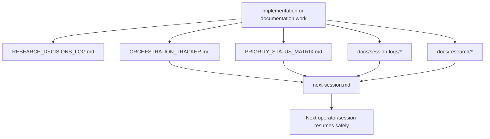

# Research and Handoffs

EVOKORE treats research continuity and session handoff state as part of the product, not as informal side notes. This page explains the documents and folders that keep multi-session work coherent.

## Why continuity is first-class here

The repo is actively maintained through layered implementation, governance, and documentation work. Without explicit continuity artifacts, it would be easy to lose:

- why a decision was made
- which validation evidence matters
- which work is complete vs merely proposed
- what the next operator should do

## Continuity flow



## Core continuity artifacts

| Artifact | Purpose | When to update |
|---|---|---|
| [ORCHESTRATION_TRACKER.md](./ORCHESTRATION_TRACKER.md) | durable execution tracker for session state and file ownership/handoff patterns | when a multi-step execution slice changes state |
| [RESEARCH_DECISIONS_LOG.md](./RESEARCH_DECISIONS_LOG.md) | durable decision history with trade-offs and follow-up | when a meaningful design/ops decision is made |
| [PRIORITY_STATUS_MATRIX.md](./PRIORITY_STATUS_MATRIX.md) | status snapshot of tracked priorities with evidence links | when a priority changes status or new evidence lands |
| [PR_MERGE_RUNBOOK.md](./PR_MERGE_RUNBOOK.md) | merge governance and dependency-chain review rules | when merge policy or review expectations change |
| [../next-session.md](../next-session.md) | concise restart point for the next session | at the end of each meaningful working session |

## Session logs

Session logs live under:

```text
docs/session-logs/
```

They capture:

- what happened in a specific execution window
- evidence and validation outcomes
- PR chain or landing state
- explicit “what’s next” notes

Use session logs for detailed chronology. Use `next-session.md` for the short restart instruction set.

## Research directory

The research directory lives at:

```text
docs/research/
```

Its purpose is to hold durable research notes that should not be mixed into the runtime docs.

Typical contents:

- implementation deep dives
- competitive/parity research
- release-process research
- dynamic-discovery research
- queue or PR audit artifacts

Start with:

- [docs/research/README.md](./research/README.md)
- [dynamic-tool-discovery-research.md](./research/dynamic-tool-discovery-research.md)
- [ecosystem-sprint-results.md](./research/ecosystem-sprint-results.md)

## How each artifact should be used

### ORCHESTRATION_TRACKER.md

Use it for:

- session snapshot state
- file ownership coordination
- high-level handoff notes
- multi-phase execution tracking

It is the best place to answer:

- what was in scope
- what changed this session
- what risks were identified

### RESEARCH_DECISIONS_LOG.md

Use it for:

- named decisions
- context and options considered
- trade-offs
- follow-up commitments

It is the best place to answer:

- why this approach exists
- what alternatives were rejected

### PRIORITY_STATUS_MATRIX.md

Use it for:

- status snapshots
- evidence links to files/tests/workflows
- concise notes on what is done vs still operational/manual

It is the best place to answer:

- what is complete
- what evidence proves it

### `next-session.md`

Use it for:

- a short, fresh, high-signal handoff
- immediate next actions
- guardrails for the next operator

It is intentionally brief. Do not turn it into a full historical log.

## Runtime continuity data outside `docs/`

Not all continuity lives in Markdown.

Runtime support artifacts include:

| Path | Purpose |
|---|---|
| `~/.evokore/logs/hooks.jsonl` | hook observability stream |
| `~/.evokore/sessions/{sessionId}.json` | canonical session continuity manifest with purpose, lifecycle metadata, artifact paths, and derived counters |
| `~/.evokore/sessions/*-replay.jsonl` | session replay summaries |
| `~/.evokore/sessions/*-evidence.jsonl` | evidence capture stream for significant tool/file/git activity |
| `~/.evokore/sessions/*-tasks.json` | TillDone task state |
| `~/.claude/projects/*/memory/MEMORY.md` | Claude auto-loaded project memory entry point |
| `~/.claude/projects/*/memory/project-state.md` | repo/worktree/session snapshot generated by EVOKORE memory sync |
| `~/.claude/projects/*/memory/patterns.md` | durable project conventions and workflow rules |
| `~/.claude/projects/*/memory/workflow.md` | restart order, session-wrap contract, and next-gate summary |

These are operational continuity aids rather than repo-historical documentation.

## Validation guardrails for continuity

Continuity is enforced with dedicated checks, including:

- `node test-next-session-freshness-validation.js`
- `node test-tracker-consistency-validation.js`
- `node test-ops-docs-validation.js`
- `node test-docs-canonical-links.js`
- `node test-pr-metadata-validation.js`

## Recommended handoff practice

When finishing a session:

1. update the code/docs you changed
2. record important reasoning in `RESEARCH_DECISIONS_LOG.md` if a real decision was made
3. update `PRIORITY_STATUS_MATRIX.md` if the status/evidence picture changed
4. add or refresh a session log when the work had meaningful chronology
5. refresh `next-session.md` with the smallest accurate restart plan

## Related docs

- [README.md](../README.md)
- [docs/README.md](./README.md)
- [TESTING_AND_VALIDATION.md](./TESTING_AND_VALIDATION.md)
- [ORCHESTRATION_TRACKER.md](./ORCHESTRATION_TRACKER.md)
- [RESEARCH_DECISIONS_LOG.md](./RESEARCH_DECISIONS_LOG.md)
- [PRIORITY_STATUS_MATRIX.md](./PRIORITY_STATUS_MATRIX.md)
